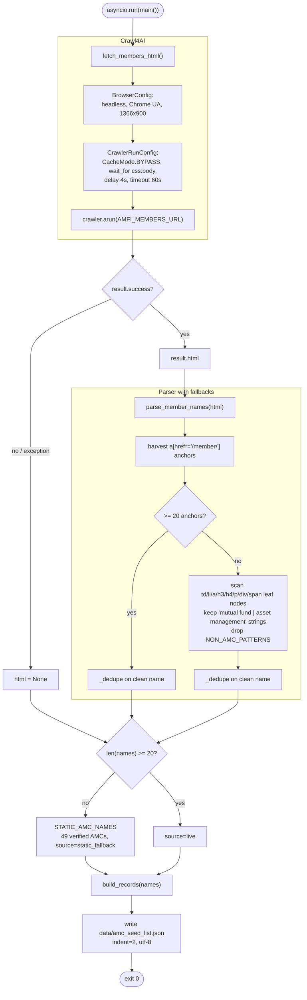
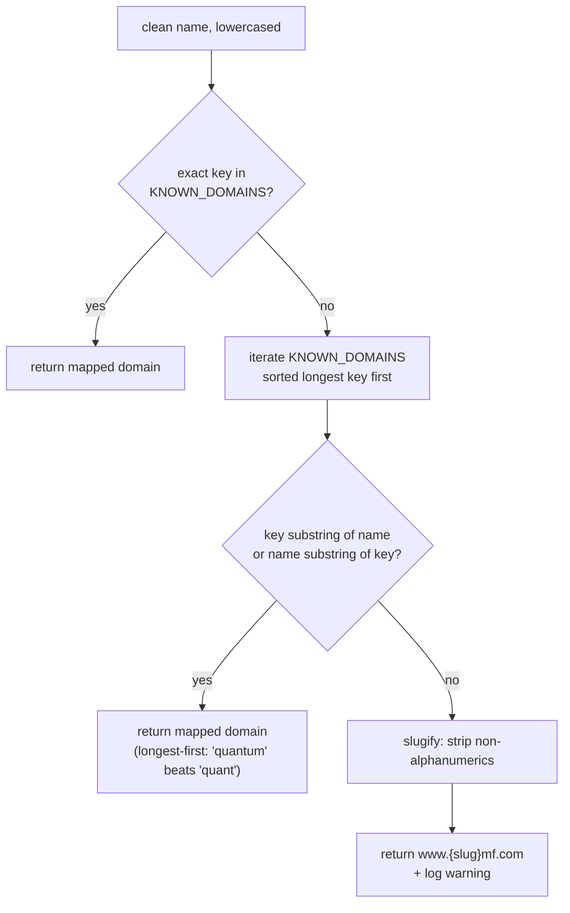
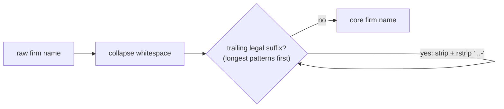

# Phase 1 Scraper (`main.py`) — Low-Level Flowchart

## Control flow

```mermaid
flowchart TD
    START(["asyncio.run(main())"]) --> FETCH["fetch_members_html()"]

    subgraph CRAWL["Crawl4AI"]
        FETCH --> BC["BrowserConfig:<br/>headless, Chrome UA, 1366x900"]
        BC --> RC["CrawlerRunConfig:<br/>CacheMode.BYPASS, wait_for css:body,<br/>delay 4s, timeout 60s"]
        RC --> ARUN["crawler.arun(AMFI_MEMBERS_URL)"]
    end

    ARUN --> OK{"result.success?"}
    OK -- "no / exception" --> NONE["html = None"]
    OK -- yes --> HTML["result.html"]

    HTML --> PARSE["parse_member_names(html)"]
    subgraph PARSER["Parser with fallbacks"]
        PARSE --> ANCH["harvest a[href*='/member/'] anchors"]
        ANCH --> A20{">= 20 anchors?"}
        A20 -- yes --> DEDUP1["_dedupe on clean name"]
        A20 -- no --> SCAN["scan td/li/a/h3/h4/p/div/span leaf nodes<br/>keep 'mutual fund | asset management' strings<br/>drop NON_AMC_PATTERNS"]
        SCAN --> DEDUP2["_dedupe on clean name"]
    end

    NONE --> COUNT
    DEDUP1 --> COUNT{"len(names) >= 20?"}
    DEDUP2 --> COUNT
    COUNT -- no --> STATIC["STATIC_AMC_NAMES<br/>49 verified AMCs, source=static_fallback"]
    COUNT -- yes --> LIVE["source=live"]

    STATIC --> BUILD["build_records(names)"]
    LIVE --> BUILD
    BUILD --> WRITE["write data/amc_seed_list.json<br/>indent=2, utf-8"]
    WRITE --> END(["exit 0"])
```

## Domain resolution (`resolve_domain`)

```mermaid
flowchart TD
    IN["clean name, lowercased"] --> EXACT{"exact key in<br/>KNOWN_DOMAINS?"}
    EXACT -- yes --> D1["return mapped domain"]
    EXACT -- no --> PART["iterate KNOWN_DOMAINS<br/>sorted longest key first"]
    PART --> HIT{"key substring of name<br/>or name substring of key?"}
    HIT -- yes --> D2["return mapped domain<br/>(longest-first: 'quantum' beats 'quant')"]
    HIT -- no --> SLUG["slugify: strip non-alphanumerics"]
    SLUG --> GUESS["return www.{slug}mf.com<br/>+ log warning"]
```

## Name cleaning (`clean_name`)

```mermaid
flowchart LR
    RAW["raw firm name"] --> WS["collapse whitespace"]
    WS --> LOOP{"trailing legal suffix?<br/>(longest patterns first)"}
    LOOP -- "yes: strip + rstrip ' ,.-'" --> LOOP
    LOOP -- no --> OUT["core firm name"]
```
