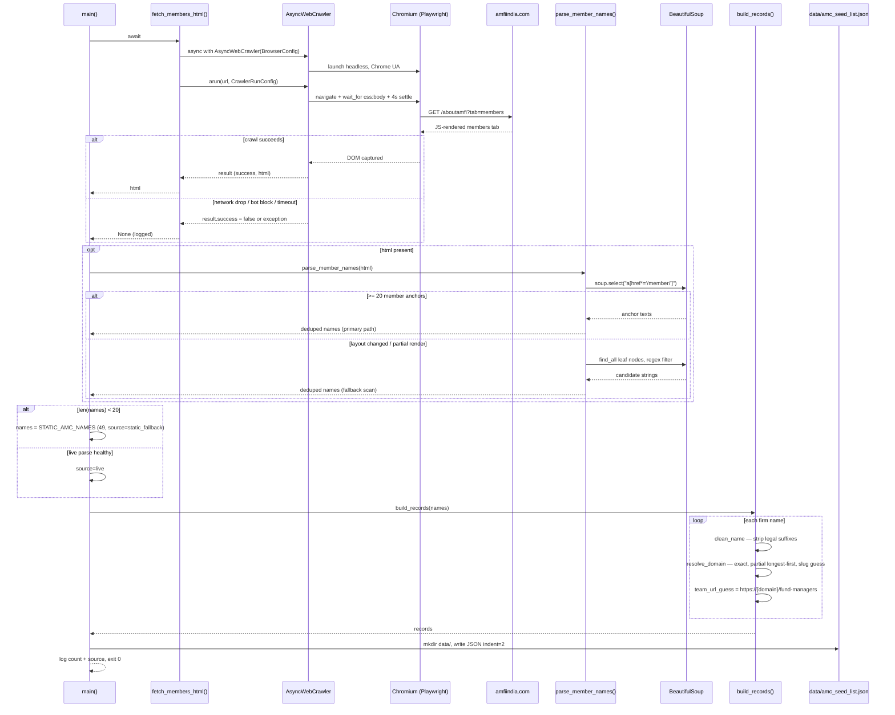

# Phase 1 Scraper (`main.py`) — Low-Level Sequence

## Call-level sequence with failure paths



## One-shot container lifecycle

```mermaid
sequenceDiagram
    actor U as User
    participant DC as docker compose
    participant IMG as image cache
    participant CT as mf-scraper container
    participant VOL as ../data bind mount

    U->>DC: docker compose run --rm scraper
    DC->>IMG: build from Dockerfile (cached after first)
    DC->>CT: create fresh container
    CT->>CT: CMD python main.py
    CT->>VOL: write /app/data/amc_seed_list.json
    CT-->>DC: exit 0
    DC->>CT: --rm deletes container
    Note over VOL: JSON persists on host disk;<br/>container is gone
```
